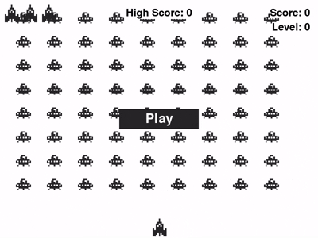

# 🚀 Alien Invasion 🌌

**Um jogo clássico de arcade com uma reviravolta espacial!**  
Ajude nossa nave heroica a deter a invasão alienígena neste jogo emocionante desenvolvido em Python com Pygame.

<div align="center">
  
</div>

## 📖 Sobre o Projeto

Este projeto foi desenvolvido seguindo os capítulos 12, 13 e 14 do livro _"Python Crash Course"_ de Eric Matthes. O objetivo principal foi compreender a estruturação de um projeto em Python e aprofundar conhecimentos em programação orientada a objetos.

## 🎮 Como Jogar

### 📋 Regras Básicas

- **3 vidas** para salvar a Terra!
- Destrua **todos os aliens** para avançar de fase!
- Cuidado: os aliens aceleram a cada fase!

### 🕹️ Controles

| Tecla  | Ação              |
| ------ | ----------------- |
| ← →    | Movimento lateral |
| Espaço | Disparar laser    |
| ESC    | Sair do jogo      |

## 🛠️ Requisitos

- Python 3.x
- Biblioteca Pygame

## ▶️ Executando o Jogo

1. Clone este repositório:
   ```bash
   git clone https://github.com/maneuu/alien-invasion.git
   ```
2. Navegue até o diretório do projeto:
   ```bash
   cd alien-invasion
   ```
3. Instale as dependências necessárias:
   ```bash
   pip install pygame
   ```
4. Execute o jogo:
   ```bash
   python alien_invasion.py
   ```
